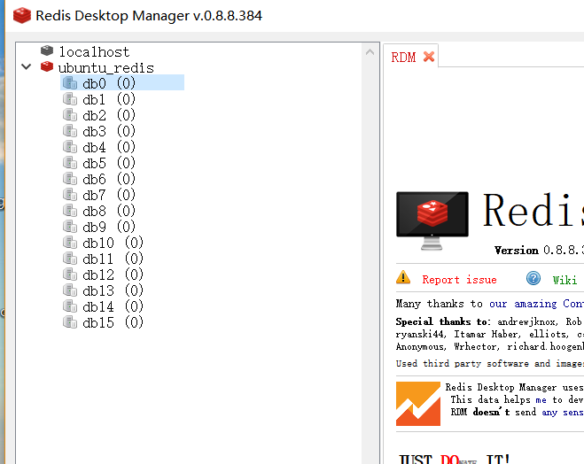
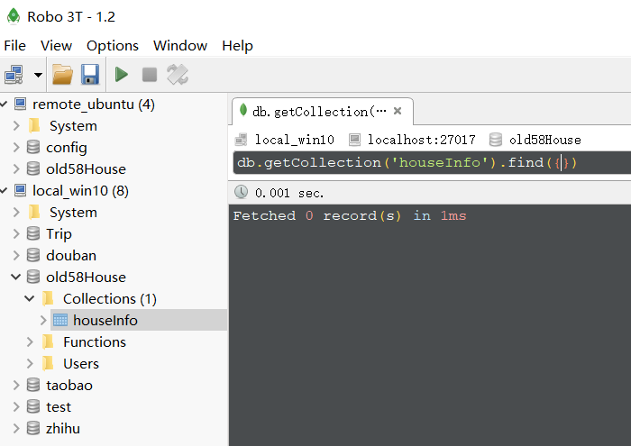
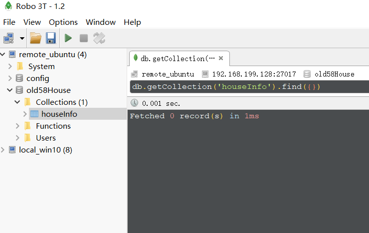
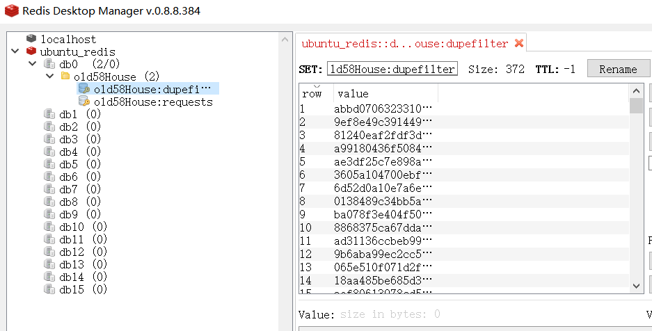
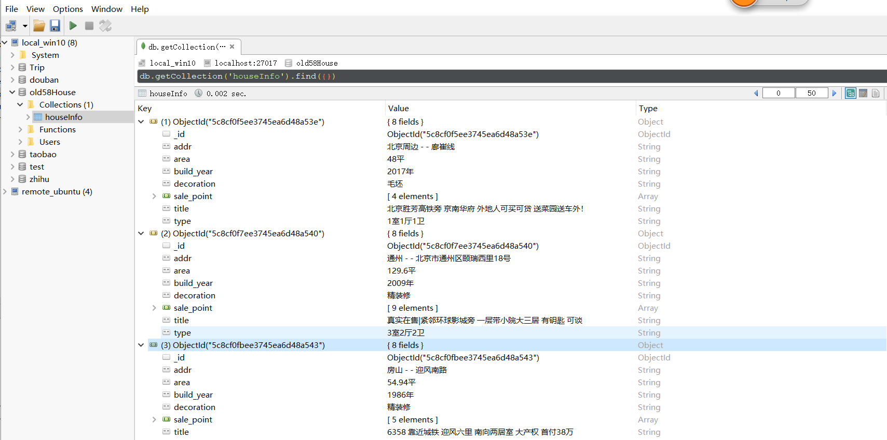
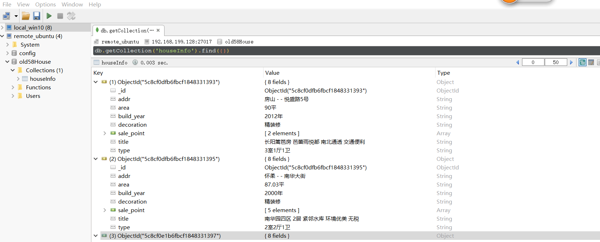

### 项目介绍
- 利用scrapy_redis分布式爬虫框架，爬取58同城北京站房产相关数据，存储到slave

从机mongodb上

### 开发环境
- python 3.6.4

### 配置开发环境
- python库：
    命令行下运行 pip install -r requirements.txt
- exe程序：

    版本管理软件: git

    数据库软件：mongodb, redis

    数据库可视化软件： robo3t(for mongodb)， RedisDesktopManager(for redis)

- settings配置：

    添加redis服务器地址>>>REDIS_URL = 'redis://name:password@ip:port'
- PS:

    确保scrapy, pip已在系统环境变量目录下

### 部署
- master主机启动redis服务和mongodb服务

- slave主机启动mongodb服务

### 启动项目
- 分别在各台主机项目目录下，启动命令行，输入：scrapy crawl old58House

### 数据库查看
- 爬取前

    远程redis

    本地mongodb

    远程mongodb

- 爬取后

    远程redis

    本地mongodb

    远程mongodb

    

